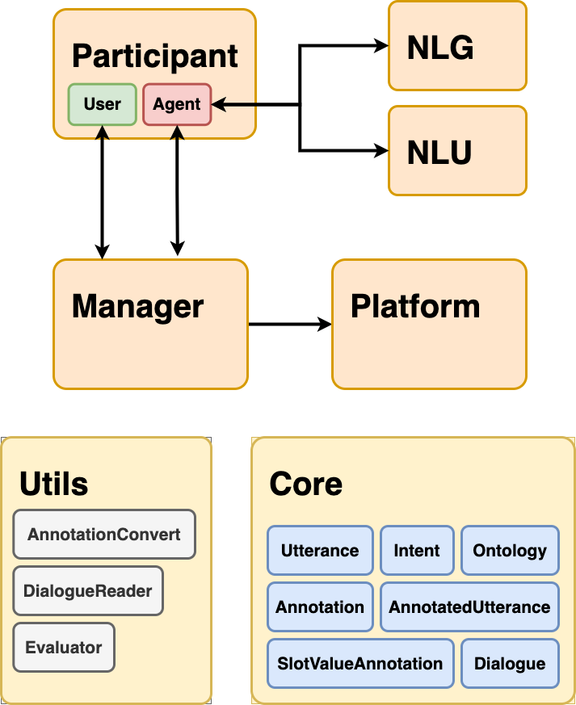

Main concepts
=============

.. todo:: Update figure to show only the main concepts listed below.

Participants 
------------

Agents and users are the participants in a dialogue.
Generally, it is assumed that the agent is a conversational system and the user is a human.
However, the agent might be played by a human ("Wizard-of-Oz") and the human user might be simulated.

Dialogue
--------

A dialogue is turn-based and takes place between two participants (agent, user) that converse about a domain such as movies and flight booking.
It is composed of a list of utterances that can be annotated or not and any relevant additional metadata. 

Dialogue Orchestration
----------------------

The dialogue orchestration includes the dialogue connector and the platform that permit the participants to communicate. 
The dialogue connector manages the dialogue between the participants while the platform ensures that the participants can read and answer each other's messages.

Natural Language Understanding (NLU)
------------------------------------

NLU is responsible for obtaining a structured representation of raw text utterances.
Here, it entails intent classification, entity recognition, and user satisfaction prediction.

For example in case of restaurant recommendation, the intent *DISCLOSE* and the slot value pair (*food*, *Turkish*) can be extracted from the utterance "I am looking for a cheap Turkish restaurant."

Natural Language Generation (NLG)
---------------------------------

NLG is responsible for creating raw text utterances from their structured representation.

For example in the case of movie recommendation, "I recommend the movie Titanic." can be generated for the intent *RECOMMEND* and slot value pair (*title*, *Titanic*).